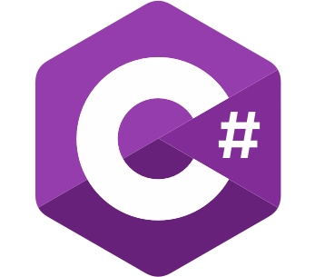
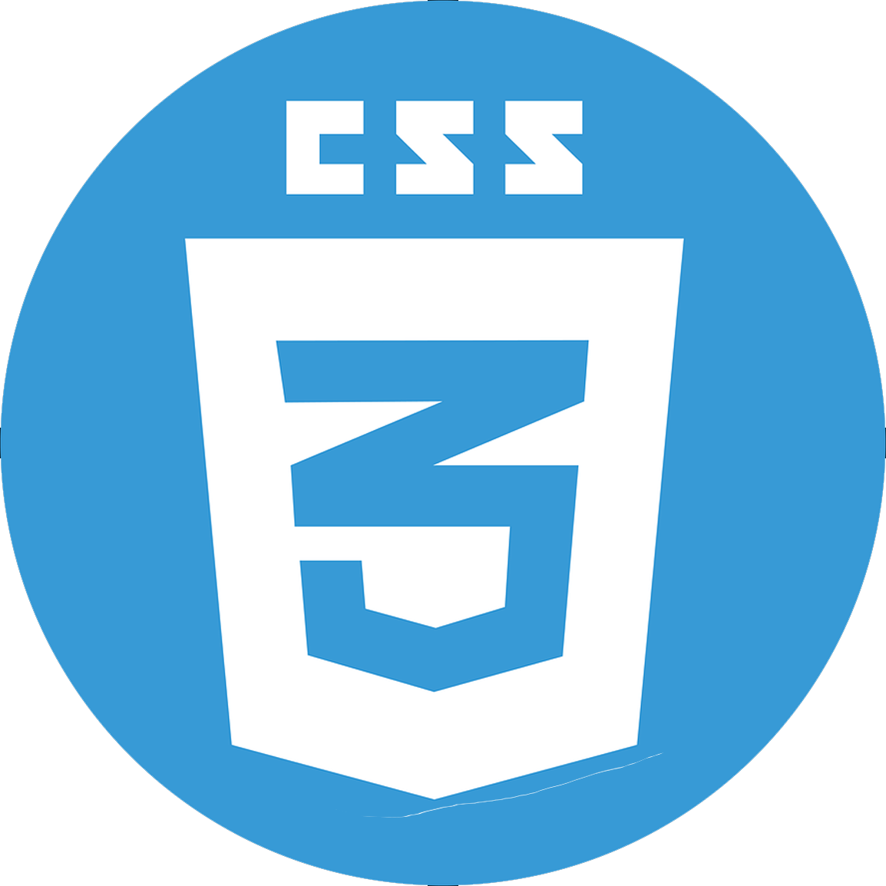
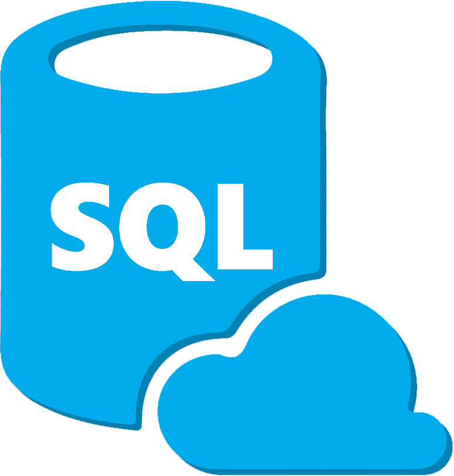
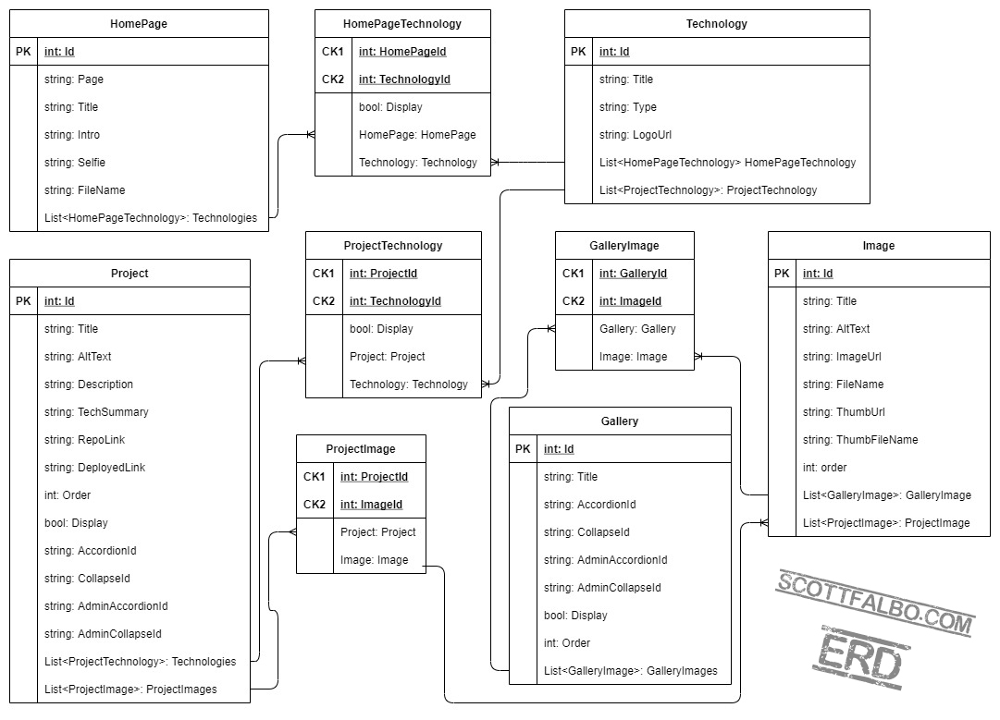

# My Portfolio Website

## About the Project
This is my personal portfolio website.  It is currently under construction and only has a main landing page.  More to come!

[scottfalbo.com](https://falboportfolio.azurewebsites.net/)  

---

## Technologies
<table>
  <tr>
    <td>
      
    </td>
    <td>
      
    </td>
    <td>
      
    </td>
    <td>
      
    </td>
    <td>
      
    </td>
    <td>
      
    </td>
    <td>
      
    </td>
  </tr>
</table>

---

## Getting Started
+ Live deployment here: [scottfalbo.com](https://falboportfolio.azurewebsites.net/)  

---

## Architecture

ERD for portfolio section, currently under construction.

---

## Change Log
+ 03/25/2021
  + Started initial scaffolding and view layouts.
  + `Microsoft.AspNetCore.Mvc.Razor.RuntimeCompilation`
+ 03/26/2021
  + Brought in the following dependencies:
    + `Microsoft.EntityFrameworkCore.SqlServer`
    + `Microsoft.EntityFrameworkCore.Tools`
    + `NewtonSoft.Json`
    + `Microsoft.AspNetCore.Mvc.NewtonsoftJson`
  + Built a database and `Models` for `Projects`.
  + Seeded the database with default projects.
  + Created an Interface and Repository for performing admin CRUD actions on the database.
  + Injected the admin dependency into the IndexModel and retrieved the saved projects.
  + Displayed the projects in the Index view.
+ 03/30/2021
  + Added breakpoints and style for desktop view.
  + deployed on Azure.
    + [FalboPortfolio.azurewebsites.net/](https://falboportfolio.azurewebsites.net/)
    + Created ERD for upcoming artwork portfolio of the site.
    + Brought in the following dependencies:
      + `Microsoft.AspNetCore.Identity.EntityFrameWorkCore`
      + `Microsoft.AspNet.Identity.Core`
      + `Microsoft.Extensions.Identity.Core`
    + Seeded the data base with an admin user.
  + 04/01/2021
    + Finished it!!! Just fooling.
    + Brought in the following dependencies:
      + `Azure.Extensions.AspNetCore.Configuration.Secrets`
    + Created a login page and secret lair page for admin purposes.
    + Set permissions for admin lair.
    + Wrote CRUD actions for projects in the AdminRepository.
    + Added forms to the admin page to update and delete projects.
  + 04/09/2021
    + Added Codewars rank to main page.
    + Created models and pages for art portal.
  + 04/20/2021
    + Created mock sql database for unit testing.
  + 04/26/2021
    + Built data structures art gallery component.
      + `Gallery<T>()` Doubly LinkedList
      + `Image<T>()` Node

---

## Contact
+ Email: Scottfalboart@gmail.com
+ [GitHub](https://github.com/scottfalbo)
+ [LinkedIn](https://www.linkedin.com/in/scott-falbo/)

---

## Acknowledgements
+ [Reference for Enumerated LinkedList](https://gist.github.com/daramasala/3c1052f189c14759597cf4667670af72)

