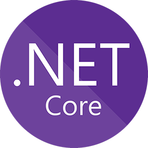
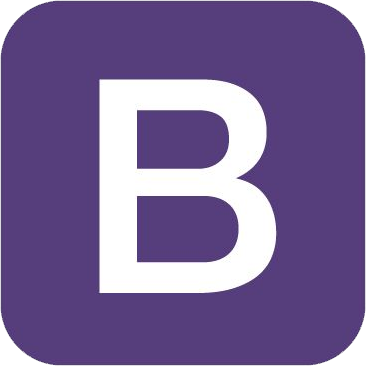
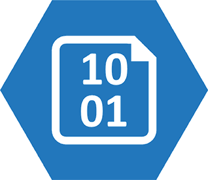
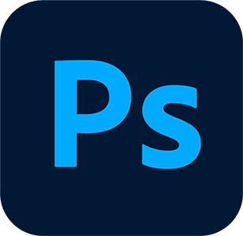

# [www.scottfalbo.com](https://www.scottfalbo.com)

## About the Project

This is my personal portfolio page for both coding projects and artwork.  It is a .NET Core application built in Visual Studio with C# and deployed on Azure.

The galleries, as well as text areas, are all stored in an AzureSQL Database.  All areas of the site can be updated via an admin dashboard with full CRUD actions.  

Gallery images are stored in an Azure Blob, all uploading and removal are handled via the admin dashboard.

All of the site contact forms utilize SendGrid.  The toggle controls to show and hide forms are handled by jQuery.

My current Instagram feed is displayed on the Art Page using the FaceBook Developers Instagram API.

All API keys, access tokens and other site secrets are stored in an Azure Key Vault.

---

## Technologies

<table border>
  <tr align=center>
    <td width=80>
       
    </td>
    <td width=80>
      
    </td>
    <td width=80>
      
    </td>
    <td width=80>
      
    </td>
  </tr>
    <tr>
    <td align=center>
      C#
    </td>
    <td align=center>
      .NET Core
    </td>
    <td align=center>
      Visual Studio
    </td>
    <td align=center>
      Azure
    </td>
  </tr>
  <tr align=center>
    <td width=80>
      
    </td>
    <td width=80>
      
    </td>
    <td width=80>
      
    </td>
    <td width=80>
      
    </td>
  </tr>
    <tr>
    <td align=center>
      HTML 5
    </td>
    <td align=center>
      CSS3
    </td>
    <td align=center>
      Bootstrap
    </td>
    <td align=center>
      GitHub
    </td>
  </tr>
  </tr>
  <tr align=center>
    <td width=80>
      
    </td>
    <td width=80>
      
    </td>
    <td width=80>
      
    </td>
    <td width=80>
      
    </td>
  </tr>
    <tr>
    <td align=center>
      AzureSQL
    </td>
    <td align=center>
      Azure Blob
    </td>
    <td align=center>
      Azure Key Vault
    </td>
    <td align=center>
      Facebook Dev
    </td>
  </tr>
  <tr align=center>
    <td width=80>
      
    </td>
    <td width=80>
      
    </td>
    <td width=80>
      
    </td>
    <td width=80>
      
    </td>
  </tr>
    <tr>
    <td align=center>
      SendGrid
    </td>
    <td align=center>
      jQuery
    </td>
    <td align=center>
      Visual Studio Code
    </td>
    <td align=center>
      Adobe Photoshop
    </td>
  </tr>
</table>

---

<!-- ## Architecture -->

---

## Change Log

+ 00/00/2021
  + **version 1.0.0**
    + Initial deployment

## Development Log

+ 03/25/2021
  + Started initial scaffolding and view layouts.
  + `Microsoft.AspNetCore.Mvc.Razor.RuntimeCompilation`
+ 03/26/2021
  + Brought in the following dependencies:
    + `Microsoft.EntityFrameworkCore.SqlServer`
    + `Microsoft.EntityFrameworkCore.Tools`
    + `NewtonSoft.Json`
    + `Microsoft.AspNetCore.Mvc.NewtonsoftJson`
  + Built a database and `Models` for `Projects`.
  + Seeded the database with default projects.
  + Created an Interface and Repository for performing admin CRUD actions on the database.
  + Injected the admin dependency into the IndexModel and retrieved the saved projects.
  + Displayed the projects in the Index view.
+ 03/30/2021
  + Added breakpoints and style for desktop view.
  + deployed on Azure.
    + [FalboPortfolio.azurewebsites.net/](https://falboportfolio.azurewebsites.net/)
    + Created ERD for upcoming artwork portfolio of the site.
    + Brought in the following dependencies:
      + `Microsoft.AspNetCore.Identity.EntityFrameWorkCore`
      + `Microsoft.AspNet.Identity.Core`
      + `Microsoft.Extensions.Identity.Core`
    + Seeded the data base with an admin user.
  + 04/01/2021
    + Finished it!!! Just fooling.
    + Brought in the following dependencies:
      + `Azure.Extensions.AspNetCore.Configuration.Secrets`
    + Created a login page and secret lair page for admin purposes.
    + Set permissions for admin lair.
    + Wrote CRUD actions for projects in the AdminRepository.
    + Added forms to the admin page to update and delete projects.
  + 04/09/2021
    + Created models and pages for art portal.
  + 04/20/2021
    + Created mock sql database for unit testing.
  + 04/26/2021
    + Built data structures art gallery component.
      + `Gallery<T>()` Doubly LinkedList.
      + `Image<T>()` Node.
    + Wrote unit tests for `Gallery<T>()`.
    + Made `Gallery<T>()` IEnumerable.
  + 05/03/2021
    + Refactored the front end layout to include secondary drop down menus in the art and admin sections.
    + Moved the content on the main page to appropriate sections.
    + Made forms and set up CRUD actions for code projects portfolio.
    + Installed the following packages:
      + `Azure.Storage.Blobs`
      + `Azure.Storage.Files.Shares`
      + `Azure.Storage.Queues`
  + 05/04/2021
    + Got images uploading to blob storage and saving the image Uri into the project SourceUrl.
  + 05/05/2021
    + Refactored delete project method to also remove the image from azure storage.
    + Added update image form to the project admin page that uploads the new image, updates the project in the database, and deletes the old image from azure storage.
  + 05/06/2021
    + Worked on admin page style for mobile and desktop.  Cleaned up menu styles a bit.
  + 05/08/2021
    + Updated all database models and added a `HomePage` model for dynamic data rendering and updating.
    + Finished crud full CRUD actions for Projects, Tattoos, and the HomePage.
    + Added forms for Tattoo and HomePage admin.
  + 05/11/2021
    + Finished all admin pages and CRUD actions site wide.
  + 05/13/2021
    + Implemented Bootstrap carousel for gallery viewer elements.
    + Built out Tattoo and Drawing gallery pages with viewers.
  + 05/15/2021
    + Refactored HomePage admin and fixed an update CRUD issue.
    + Scaffolded out the art main page.  Added dependency injection for tattoo and drawing gallery data.
  + 05/16/2021
    + Worked out desktop and mobile style for the art and code main pages.
    + Brought in `Microsoft.AspNet.WebApi.Client` NuGet package.
  + 05/21/2021
    + Implemented the Facebook Dev Instagram API.  Makes a query for a list of recent media posts, then loops through the list querying each image url.
    + Created partials and added an Instagram gallery viewer to the art home page.
    + Added a "Refresh Feed" and "Refresh Token" form to SecretLair admin.  The first queries the Instagram API for my most recent media, removes the old from the database, and saves the new.  The second refreshes my access_token which expires every 60 days.
    + Added CRUD actions for the Instagram database table.
  + 05/27/2021
    + Instagram feed successfully displaying in gallery viewer on art main page.
  + 05/28/2021
    + Installed `SendGrid` NuGet package.
    + Created a request form under the booking route.
    + Added models, interfaces and services for SendGrid.
    + Created a method to take in form data and send an email.
    + Made a confirmation popup after a successful response is received from SendGrid.
    + Fixed a CSS issue with the mobile gallery viewer.  Images are properly displayed and responsive.
  + 06/04/2021
    + Finished implementing SendGrid and set up templates.  Added a general contact pop up form that appears when the contact button is clicked.
    + Finished site wide style, well... is css ever really done.  It's done enough to deploy.
    + added image assets for navigation buttons, including social links.
  + 06/10/2021
    + added the follow dependencies:
      + `Azure.Security.KeyVault.Secrets`
      + `Microsoft.Azure.Management.KeyVault`
      + `Microsoft.IdentityModel.Clients.ActiveDirectory`
      + `Microsoft.Azure.KeyVault.WebKey`
      + `Microsoft.Azure.Services.AppAuthentication`
      + `Microsoft.Configuration.ConfigurationBuilders.Azure`
      + `Microsoft.Configuration.ConfigurationBuilders.Base`
      + `Microsoft.Rest.ClientRuntime`
      + `Microsoft.Rest.ClientRuntime.Azure`
    + Fixed custom domain C_NAME issue.
    + Fixed non-secure connection issue.
    + Set up Azure Key Vault and moved all of the app secrets there.
  + 06/12/2021
    + Added a studio section to the art main page.
    + Used Google API to display a map to the studio.
  + 06/14/2021
    + Added a page for the studio the art section of the site.
    + Made a `Studio` model and added CRUD UI to the admin dashboard for text areas.
  + 06/18/2021
    + Built out the studio page. Added jQuery controls to hide and show info pop ups.
    + Fixed a bunch of sire wide grid issues and finished overall styling.

---

## Contact

+ Email: Scottfalboart@gmail.com
+ [GitHub](https://github.com/scottfalbo)
+ [LinkedIn](https://www.linkedin.com/in/scott-falbo/)

---

## Acknowledgements

+ [Bootstrap Carousel](https://getbootstrap.com/docs/4.0/components/carousel/)
+ [json2csharp](https://json2csharp.com/)
+ [Microsoft Docs](https://docs.microsoft.com/en-us/)
+ [Google Maps dark mode script](https://developers.google.com/maps/documentation/javascript/examples/style-array)
